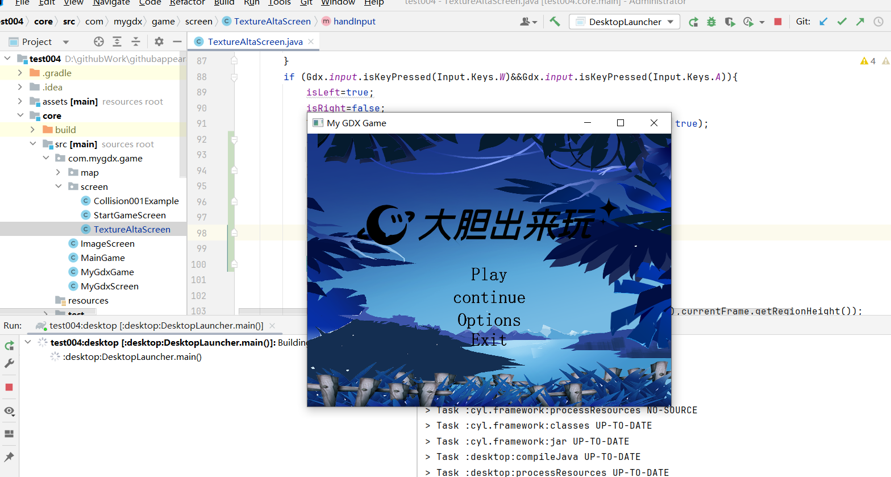
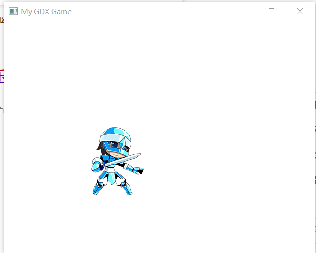
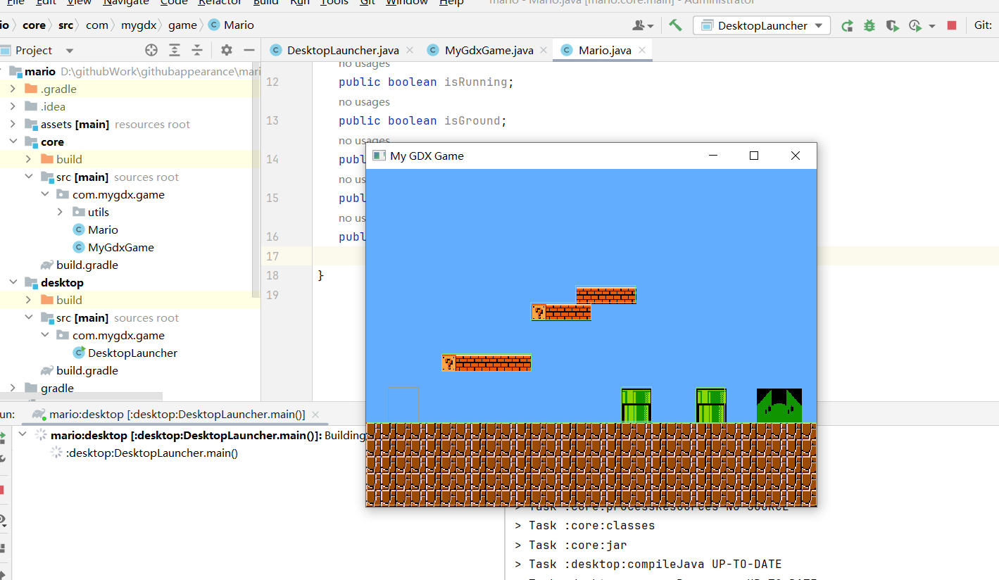
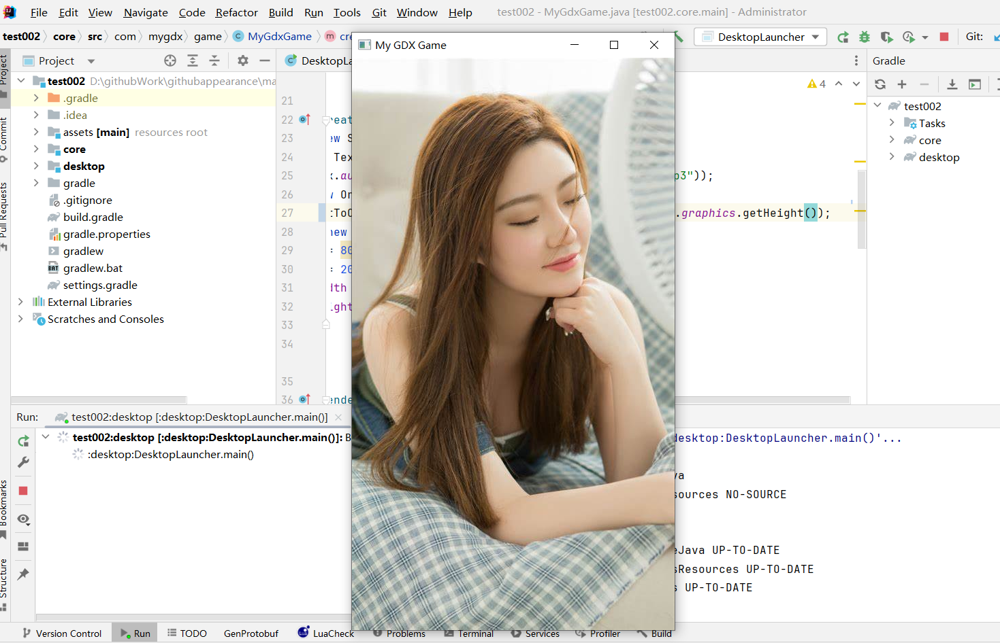

# LibgdxProject
libgdx的游戏项目，马里奥之类的，仅供学习使用

test004效果图：

点击play：

可以上下左右移动

mario项目效果图：

地图用的tiled，用来staticBody来搞这些墙之类的，然后用一个动态的body来代替人物

test002效果图：

点开之后，播放音乐，只是单纯的测试相机和音乐的。

test项目是马里奥初级项目，就是会报一个Caused by: com.badlogic.gdx.utils.SharedLibraryLoadRuntimeException: Couldn't load shared library 'gdx-box2d64.dll' for target: Windows 10, 64-bit这个错误，因为没有在创建阶段就点那个box2d的那个，所以会出现这个问题

